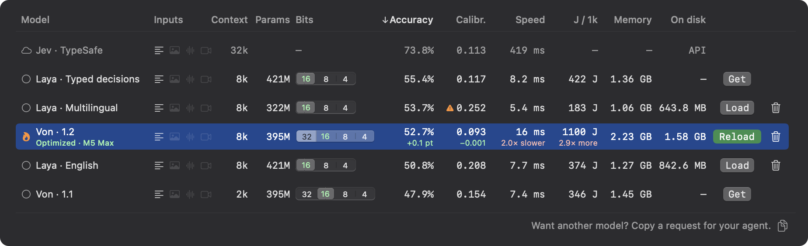
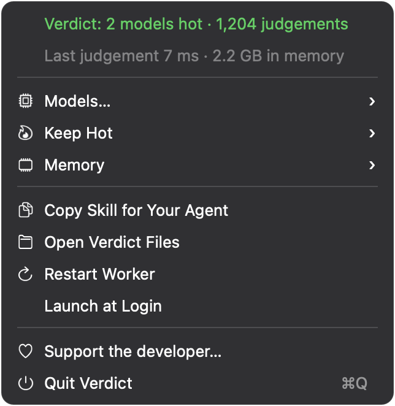

<p align="center">
  
</p>

<h1 align="center">Verdict</h1>

<p align="center">A local System One server for your Mac, compatible with the System One API (TypeSafe Jev).</p>

<p align="center">
  <a href="#install"></a>
  &nbsp;
  <a href="https://github.com/sponsors/TobyNoSkillSon"></a>
</p>

<p align="center">
  <a href="#system-one-models">System One models</a> ·
  <a href="#switch-from-jev">Switch from Jev</a> ·
  <a href="#for-your-agent">For your agent</a> ·
  <a href="#models">Models</a> ·
  <a href="#the-app">The app</a> ·
  <a href="#install">Install</a> ·
  <a href="#using-it">Using it</a> ·
  <a href="docs/USAGE.md">User guide</a> ·
  <a href="docs/API.md">API</a>
</p>

**Verdict is a local System One server for your Mac.** It is compatible with the System One API (TypeSafe Jev) and runs open decision models natively on MLX, and it works with the TypeSafe SDK: code written for Jev moves to Verdict by changing its base URL and model name. Send a state and typed questions — yes/no, pick one of these options, where on this rubric — and get a calibrated probability for every answer in milliseconds, with nothing leaving the Mac. Verdict is an independent project, not affiliated with TypeSafe.

It is also a menu-bar app that keeps those models loaded for coding agents. An agent sends a batch of items with the same questions, then filters, sorts and routes in code and reads only what matters. You install Verdict once, give your agent the included skill, and the app stays out of the way.

<p align="center">
  
</p>

## System One models

**System One models** — also called *decision models* — are a class of model built to make fast, structured decisions for software rather than to write text. TypeSafe named the class when it released [Jev](https://typesafe.ai/blog/introducing-system-one-models-and-jev) in September 2026, after Kahneman's fast System 1 and slow System 2; [Laya](https://huggingface.co/convaiinnovations/laya) was the first open one, and others have followed. They share three traits:

- **Typed questions, defined at request time.** You ask *choice* (pick one of these options), *score* (where on this rubric) or *yes/no* questions about a piece of text. The options are yours, not fixed at training time the way an ordinary classifier's labels are.
- **Probabilities, not prose.** Every answer comes with a probability, trained to be calibrated. Nothing is generated, so there is nothing to parse and nothing to hallucinate.
- **One forward pass.** All questions about an item are answered together, in milliseconds.

Verdict is a runtime for this class: the open System One models that run well on a Mac, loaded once, behind the System One API.

## Switch from Jev

Point the client at Verdict, pass any key (none is checked), and name a local model — `auto` routes English to Laya English and anything else to Laya Multilingual. `verdict url` prints the base URL; it changes when Verdict restarts.

```python
# pip install typesafe-sdk
import sys, os; sys.path.insert(0, os.path.expanduser("~/.local/share/verdict"))
import verdict
from typesafe_sdk import TypeSafeClient, Noul, Choice, Score

client = TypeSafeClient(api_key="local", base_url=verdict.base_url(), model="auto")   # for Jev: your key, model="jev-latest"
review = client.system_one("Update 3.2 logs me out every time I switch apps.", {
    "bug": Noul(instructions="Does the writer report something broken?"),
    "kind": Choice(instructions="What kind of message is this?", criteria={"bug": None, "feature": None, "question": None}),
    "priority": Score(instructions="How soon does it need a fix?", criteria=["whenever", "this sprint", "today"]),
})
print(review.nouls["bug"].noul, review.choices["kind"].choice, review.scores["priority"].score)   # 0.7707 bug 1.7577
```

```js
// npm install @typesafe-ai/sdk;  run with TYPESAFE_BASE_URL=$(verdict url) TYPESAFE_API_KEY=local
import { TypeSafeClient, noul } from "@typesafe-ai/sdk";
const local = new TypeSafeClient({ defaultModel: "auto" });
const review = await local.systemOne({ state: "Update 3.2 logs me out every time I switch apps.", questions: { bug: noul("Does the writer report something broken?") } });
console.log(review.answers.bug.noul);
```

```sh
curl -s "$(verdict url)/v1/systemone" -H 'Content-Type: application/json' \
  -d '{"model": "auto", "state": "Update 3.2 logs me out every time I switch apps.", "questions": {"bug": {"type": "noul", "instructions": "Does the writer report something broken?"}}}'
# {"answers": {"bug": {"noul": 0.7707, "type": "noul"}}, "model": "laya-english", "usage": {"input_tokens": 46, "output_tokens": 0}}
```

```swift
import VerdictKit                                        // this package's library product
let client = SystemOneClient()                           // finds or launches the local Verdict
let review = try await client.systemOne(state: "Update 3.2 logs me out every time I switch apps.",
                                        questions: ["bug": .noul("Does the writer report something broken?")])
print(review.nouls["bug"]?.noul ?? 0)
// Any other compatible server: SystemOneClient(baseURL: URL(string: "https://api.typesafe.ai")!, apiKey: key, model: "jev-latest")
```

What differs: the models are smaller and less accurate than Jev on the benchmark below, so check your questions on both; contexts are 8k tokens (2k for Von 1.1); the first use of a model downloads it. `bits` is an optional extension that asks for a precision; a request can only get the precision the model already runs at, so one client never changes another's answers. Concurrent requests are merged into shared GPU passes, so many parallel SDK calls run at about 80% of the batch rate; a merged answer can move by up to about 0.03 from the same request sent alone (the models' own batch arithmetic, as in any batch), and `"merge": false` asks for the single-request answer. [docs/API.md](docs/API.md#differences-from-jev) has the full list.

## For your agent

Ask a coding agent to work through 800 grep hits or 40,000 transcript turns and it either reads everything, filling its context, or samples and guesses. A model loaded fresh by each script pays its loading cost on every run. Verdict pays it once and keeps the model hot, so deciding what to read costs milliseconds and no tokens.

Your agent installs the skill, called `triage`, into its own harness from `verdict skill` (the menu's **Copy Skill for Your Agent** copies the same text). It teaches the agent when Verdict is worth using, how to call it and how to write questions. This is the pattern: ask the same questions of every item, keep the answers in order, and shortlist in code.

```python
import sys, os
sys.path.insert(0, os.path.expanduser("~/.local/share/verdict"))  # installed with Verdict
from verdict import judge, Noul, Choice, Score

questions = {
    "relevant": Noul("Is this hit about the authentication flow?"),
    "kind": Choice("What kind of file is this?",
                   source="application code", test="tests or fixtures", other="anything else or unclear"),
    "risk": Score("What would a change here affect?",
                  ["an isolated helper", "a shared module", "a public interface or migration"]),
}

shortlist = []
for hit, result in zip(hits, judge(hits, questions)):
    if result.error:
        raise RuntimeError(result.error)            # never silently drop a failed item
    if result.relevant > 0.6 and result.kind == "source":
        shortlist.append((float(result.risk), hit))
shortlist.sort(key=lambda row: row[0], reverse=True)  # read these, not every hit; ties keep input order
```

| Question | Answer |
|---|---|
| `Noul` (yes/no) | Probability that the proposition is true |
| `Choice` | The most probable label, with a probability per option |
| `Score` | Expected level on an ordered rubric, from zero |

Answers compare like plain values; `.confidence` and `.probabilities` carry the detail. The 0.6 threshold above is illustrative. Check thresholds on labelled examples from your own task before a result gates anything — the library's `calibrate()` does this from about 30 labelled items, and `gate()` wraps a yes/no check around an action.

Typical jobs: filter search hits before opening files, route support tickets, flag shell commands for review (as one layer alongside permissions, not instead of them), mine transcripts for user corrections, triage a feed before writing a shortlist.

## Models

The catalog today: three Laya models and two Von models, all for text, all running natively on MLX. Jev is listed as a reference; it is hosted and closed, and Verdict cannot load or call it.

Figures are at each model's recommended precision (16-bit for every model today), from Verdict's 25-task suite: topic, intent, emotion, review stars, NLI, relevance, safety and multilingual sets, zero-shot. Measured on an Apple M5 Max, macOS 26.6, 25 September 2026.

| Model | Params | Context | Languages | Bits | Accuracy | Calibration | Single | Batched | Energy | Memory |
|---|---|---|---|---|---|---|---|---|---|---|
| **Laya · English** | 421M | 8k | English | 16 | 50.8% | 0.208 | 7.7 ms | 608/s | 374 J/1k | 1.27 GB |
| **Laya · Multilingual** | 322M | 8k | 100+ | 16 | 53.7% | 0.252 ⚠ | 5.4 ms | 1,406/s | 183 J/1k | 1.06 GB |
| Laya · Typed decisions | 421M | 8k | English | 16 | 55.4% | 0.117 | 8.2 ms | 607/s | 422 J/1k | 1.36 GB |
| Von · 1.2 | 395M | 8k | English | 16 | 52.6% | 0.094 | 7.9 ms | 695/s | 379 J/1k | 1.46 GB |
| Von · 1.1 | 395M | 2k | English | 16 | 47.9% | 0.154 | 7.4 ms | 750/s | 346 J/1k | 1.45 GB |
| Jev · TypeSafe | — | 32k | English | — | 73.8% | 0.113 | ~419 ms | — | — | — |

- **Bold** models are the two that `model="auto"` routes to: plain English text to Laya English, anything else to Laya Multilingual. Laya Typed decisions is Convai's fine-tuned example for invoices, incidents and support tickets.
- **Accuracy** is the mean across the 25 tasks. **Calibration** is expected calibration error, lower is better: whether a reported 90% is right about 90% of the time. ⚠ Laya Multilingual's error is above 0.25: use its answers, but do not treat its probabilities as thresholds without checking them on your data.
- **Single** is the median wall time for one short item per request. **Batched** is items per second on 1,000 job ads × 2 questions, 256 per request. **Energy** is net SoC joules per 1,000 judgements in a batched workload, idle power subtracted. **Memory** is the loaded process footprint.
- **Jev** was measured on the same 25-task suite through OpenRouter on 25 September 2026 (TypeSafe Jev 1.13, 7,799 judgements, one per request). Its single time includes the network round trip from this Mac, so it does not compare with the local timings; batched, energy and memory do not apply.

These are benchmark results, not accuracy on your task. Every figure is in [`Resources/benchmarks.json`](Resources/benchmarks.json), and `verdict models --all` prints them.

**Recommended precision.** A model loads at its recommended precision unless you pick another: among its measured precisions within 0.5 accuracy points of its native one, the one with the lowest energy per judgement. Today that is 16-bit for every model. Laya is natively 16-bit; 8 and 4 bits use less memory but are slower here and lose up to about a point of accuracy. Von is natively 32-bit, and 16-bit is about twice as fast, uses about 0.8 GB less and a third of the energy, within 0.1 points of accuracy. The 32-bit path is the one that matches the Von SDK's probabilities within 0.0001; 16-bit can move near-tie probabilities by up to about 0.08, so select 32 when you need SDK-exact numbers.

<details>
<summary>Every precision</summary>

| Model | Bits | Accuracy | Calibration | Single | Batched | Energy | Memory |
|---|---|---|---|---|---|---|---|
| Laya · English | **16** | 50.8% | 0.208 | 7.7 ms | 608/s | 374 J/1k | 1.27 GB |
| Laya · English | 8 | 50.7% | 0.209 | 8.9 ms | 541/s | 412 J/1k | 0.88 GB |
| Laya · English | 4 | 49.7% | 0.197 | 8.4 ms | 547/s | 429 J/1k | 0.71 GB |
| Laya · Multilingual | **16** | 53.7% | 0.252 | 5.4 ms | 1,406/s | 183 J/1k | 1.06 GB |
| Laya · Multilingual | 8 | 53.7% | 0.251 | 6.1 ms | 1,051/s | 212 J/1k | 0.98 GB |
| Laya · Multilingual | 4 | 52.7% | 0.267 | 5.9 ms | 1,070/s | 209 J/1k | 0.92 GB |
| Laya · Typed decisions | **16** | 55.4% | 0.117 | 8.2 ms | 607/s | 422 J/1k | 1.36 GB |
| Laya · Typed decisions | 8 | 55.4% | 0.117 | 10.0 ms | 524/s | 470 J/1k | 0.94 GB |
| Laya · Typed decisions | 4 | 54.9% | 0.120 | 9.6 ms | 536/s | 466 J/1k | 0.76 GB |
| Von · 1.2 | 32 | 52.7% | 0.093 | 15.9 ms | 219/s | 1,100 J/1k | 2.23 GB |
| Von · 1.2 | **16** | 52.6% | 0.094 | 7.9 ms | 695/s | 379 J/1k | 1.46 GB |
| Von · 1.2 | 8 | 52.6% | 0.095 | 8.8 ms | 627/s | 415 J/1k | 1.12 GB |
| Von · 1.2 | 4 | 51.9% | 0.101 | 8.8 ms | 644/s | 409 J/1k | 0.95 GB |
| Von · 1.1 | 32 | 48.0% | 0.155 | 15.2 ms | 228/s | 1,050 J/1k | 2.24 GB |
| Von · 1.1 | **16** | 47.9% | 0.154 | 7.4 ms | 750/s | 346 J/1k | 1.45 GB |
| Von · 1.1 | 8 | 48.0% | 0.155 | 8.0 ms | 673/s | 388 J/1k | 1.11 GB |
| Von · 1.1 | 4 | 48.5% | 0.146 | 7.7 ms | 696/s | 380 J/1k | 0.94 GB |

Bold is the recommended precision. Von's 32-bit rows run on the regular GPU path; the neural accelerators on M5-class GPUs run 16-bit matrix multiplications only.

</details>

<details>
<summary>Context and limits</summary>

**Context.** Laya and Von 1.2 run at the encoder's limit of 8,192 tokens. (Laya's upstream default is 512 tokens; Verdict loads it at the full 8,192.) Von 1.1 accepts 2,048 tokens, the `max_position_embeddings` in its checkpoint. Questions count toward the budget. An item that does not fit gets its own error in the results — it is never truncated — and the rest of the batch is answered.

**Limits.** Each judgement sees one item, not the collection: sort scores in code rather than expecting cross-item reasoning, and use ordinary code for counting, arithmetic and dates. Keep choice labels distinct, include an escape option such as `other`, and write rubric levels as checkable situations. Test domain-specific rules on labelled examples before relying on them.

**Adding models.** The catalog is [`Resources/models.json`](Resources/models.json). A candidate needs open weights, a typed-question interface with per-answer probabilities and an architecture that can be implemented on mlx-swift; [adding models](docs/USAGE.md#adding-models) lists the steps.

</details>

## The app

The menu shows how many models are hot, the judgement count, the last judgement's time and memory in use. **Models…** opens the table above. **Copy Skill for Your Agent** is the handoff to your agent, and **Launch at Login** keeps Verdict available without opening it yourself.

<p align="center">
  
</p>

**A fresh install loads nothing.** The first request that needs a model downloads it from Hugging Face (0.6–1.6 GB, once) and loads it; **Get** in the table does the same ahead of time. A flame marks a hot model, **Unload** frees its memory without deleting the weights, and the trash icon deletes them.

**Precision** is chosen per model in the table's Bits control, with the recommended precision in green. Selecting another precision shows its numbers against the recommended one and reloads nothing: in the screenshot at the top, 32-bit Von 1.2 is 0.1 points more accurate than 16-bit but 2.0× slower and uses 2.9× the energy; on a hot model the button becomes **Reload**, which applies it.

**Engine.** Under a hot model's name, **Optimized · M5 Max** (your chip) means Verdict's fast tokenizer and windowed-attention kernel passed their self-test when the model loaded on this Mac. **MLX** means some or all of those optimizations are off: the same model, slower. Its tooltip says what is active and why. If the optimized path fails during a request, Verdict reruns that request on the stock MLX path and keeps the model there until it is reloaded.

**Keep Hot** sets an idle window for each kind of load, timed per model from its last request:

| | Loaded how | Idle window | Next launch |
|---|---|---|---|
| **Manually loaded** | **Load** or **Reload** in the table, or `verdict load <id> --manual` | Always (default), 15, 30 or 60 min | Loaded again |
| **Loaded on demand** | A request needed a model that was not hot | 15 min (default), 5, 30, 60 min or Always | Not loaded |

An unloaded model loads again on the next request that needs it.

**Memory → Fit in free memory**, the default, checks before each load that the model fits in memory macOS can hand out without swapping. If it does not, Verdict unloads idle models to make room — on-demand ones first, least recently used first, never one serving the current request — or refuses the load with the numbers and the ways out, for example `von-1.2 at 16-bit needs ~2.0 GB; ~0.9 GB free without swapping. Unload laya-english, pick 8-bit, or allow swap in Verdict → Memory.` Agents get that text as an HTTP 507 error. The check is best effort: memory use can change after it, and other apps can still push macOS into swap. **Allow swap (slower)** skips the check and loads anyway; macOS moves data to disk, and everything on the Mac can slow down. The [user guide](docs/USAGE.md#menu) gives the exact calculation.

## Install

Tell your agent:

```text
Install Verdict from https://github.com/TobyNoSkillSon/Verdict — follow its AGENTS.md, then install its skill into your harness.
```

It clones the repository and runs `scripts/install.sh`, which downloads the prebuilt app for that version with curl, checks its SHA-256 and code signature, installs it in `/Applications` (or `~/Applications`), links the `verdict` command into `~/.local/bin`, puts the Python library in `~/.local/share/verdict`, starts the app and waits until it answers. The agent then installs the skill into its harness and reports back. Nothing is loaded yet: `verdict status` says `models: none loaded` until the first judgement. Turn on **Launch at Login** in the menu if you want Verdict always there.

**Requirements.** Apple Silicon, macOS 14 or newer, and `python3` for the installer and the Python library (macOS's own is fine; `xcode-select --install` provides it). The prebuilt app needs no Xcode, Python packages or developer account. Disk: about 40 MB for the app (a 10 MB download) plus 0.6–1.6 GB per model you use.

**Tested hardware.** Verdict is developed, measured and tested on an M5 Max running macOS 26. Other Apple Silicon Macs are expected to work: the optimized kernels self-test at load and fall back to the stock MLX path if they fail, and the GPU neural accelerators are only used where MLX supports them (M5-class GPUs on macOS 26.2+). Other chips have not been verified yet, and speed and energy there will differ from the table.

<details>
<summary>Installing by hand</summary>

```sh
git clone https://github.com/TobyNoSkillSon/Verdict && cd Verdict
scripts/install.sh
verdict skill                     # prints the skill; `verdict skill --install DIR` writes DIR/triage/SKILL.md
```

Download the release through the installer, not a browser. A browser adds the quarantine flag, and Gatekeeper blocks the ad-hoc-signed app. The SHA-256 detects a corrupted download; it comes from the same release, so it is not a signature.

</details>

**Updating.** `git pull && scripts/install.sh`, or ask your agent. Downloaded models and settings are kept. The installer quits an idle Verdict itself and refuses while a model is loading.

**Uninstalling.** Delete downloaded models from the table first if you want their disk space back (weights live in `~/.cache/huggingface`; do not delete the whole cache if other tools use it). Then quit Verdict and remove `/Applications/Verdict.app`, `~/Library/Application Support/Verdict`, `~/.local/bin/verdict` and `~/.local/share/verdict`.

## Using it

Everything talks to one local HTTP API: an endpoint compatible with the System One API (TypeSafe Jev), plus Verdict's batch and management endpoints. The app, the `verdict` command, the Python library and the Swift package are its clients, and it works with the TypeSafe SDK. [docs/USAGE.md](docs/USAGE.md) covers the menu, the command line and writing questions; [docs/API.md](docs/API.md) documents every endpoint, error and client.

**Command line.** `verdict judge` reads JSONL (one JSON value per line; `--field` picks a key from each object) and prints one short line per item, so an agent spends few tokens reading it. `--json` prints every probability as JSON lines instead.

```sh
$ cat q.json
{"relevant": {"type": "noul", "instructions": "Is this hit about the authentication flow?"}}
$ verdict judge --questions q.json --sort relevant < hits.jsonl
#2  relevant=0.77  | src/auth/login.ts: validates the OAuth state parameter
#0  relevant=0.54  | src/auth/session.ts: refreshToken() retries on 401
#1  relevant=0.05  | docs/CHANGELOG.md: 1.4.0 new colour palette for the settings
#3  relevant=0.04  | src/billing/invoice.ts: rounds totals to two decimals
```

`verdict status` shows what is loaded and on which engine, `verdict models` the catalog with its figures, and `verdict info <model>` the task breakdown and links to the model card and weights.

**HTTP.** From any language: the System One API ([Switch from Jev](#switch-from-jev)) for one state at a time, or Verdict's batch extension for many items in one request:

```sh
curl -s "$(verdict url)/v1/judge" -H 'Content-Type: application/json' \
  -d '{"items": ["The export button does nothing", "Please add a CSV option"], "questions": {"bug": {"type": "noul", "instructions": "Does the writer report something broken?"}}}'
```

**Python.** The library in `~/.local/share/verdict` uses only the standard library and starts the app if it is not running; the example is under [For your agent](#for-your-agent).

**Swift.** VerdictKit is a library product of this package, with no dependencies of its own. `SystemOneClient` has the TypeSafe SDK's call shape; `judge` is its batch extension:

```swift
// .package(url: "https://github.com/TobyNoSkillSon/Verdict", branch: "main"), product "VerdictKit"
import VerdictKit

let client = SystemOneClient()           // finds the running app, or launches it
let results = try await client.judge(items: reviews, questions: [
    "bug": .noul("Does the writer report something broken?"),
    "kind": .choice("What kind of message is this?", ["bug": "something is broken", "feature": "a request for something new", "question": "asks for information"]),
])
```

## Privacy

Judgement inputs never leave your Mac. The API listens on `127.0.0.1` only and refuses requests that carry a browser `Origin` header or a foreign `Host`. It has no authentication (an SDK's API key is accepted and ignored), so any process on your Mac can call it; do not forward the port. The only network traffic is the app download at install and model weights from Hugging Face on first use. There is no telemetry and no hosted fallback.

Verdict judges text. An item with an `image`, `audio` or `video` field comes back as a per-item error.

## Building from source

```sh
VERDICT_BUILD=source scripts/install.sh      # build this checkout and install it
scripts/build.sh                             # build dist/Verdict.app only
```

A source build needs full Xcode, its Metal Toolchain (`xcodebuild -downloadComponent MetalToolchain`) and the Command Line Tools Swift; the installer checks each and prints the command that fixes a missing one. The app is a Swift menu-bar process that supervises `verdict-helper`, the MLX service that runs the models; both, the `verdict` command and VerdictKit are built from `Sources/`.

## License

[Apache-2.0](LICENSE). Keep the [NOTICE](NOTICE) when you redistribute. Verdict ships no model weights. Laya is by Convai Innovations (Apache-2.0); Verdict downloads community MLX conversions from [aac6fef on Hugging Face](https://huggingface.co/aac6fef/laya-mlx), and its Laya code is a Swift port of [laya-mlx](https://github.com/mizorewww/laya-mlx) (Apache-2.0). Von is by Victor Hugo Panisa (wfzyx; Apache-2.0), downloaded from [huggingface.co/wfzyx/von](https://huggingface.co/wfzyx/von) at pinned revisions, and its Von code is a Swift port of von-sdk (Apache-2.0). The app bundles MLX, swift-transformers and their dependencies; [THIRD_PARTY_NOTICES.txt](Resources/THIRD_PARTY_NOTICES.txt) has each licence, and Verdict.app carries it with LICENSE and NOTICE in `Contents/Resources` (`verdict licenses` prints them).
