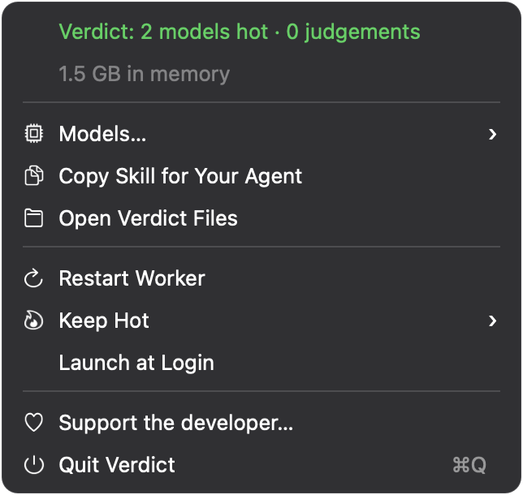
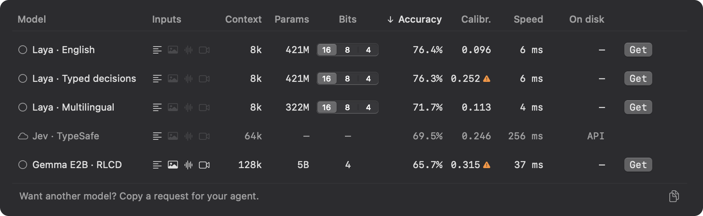
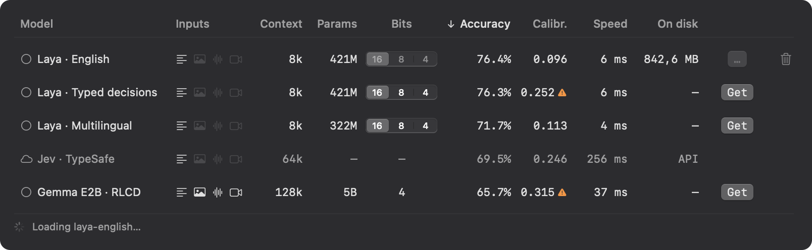
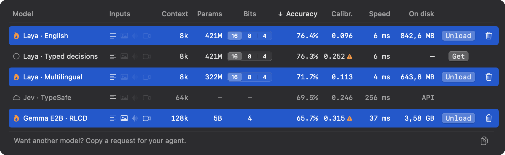
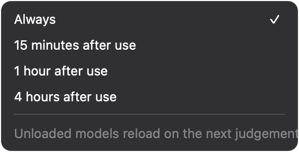

<p align="center">
  
</p>

<h1 align="center">Verdict</h1>

<p align="center">A local runtime for System One models, kept ready for your coding agent.</p>

<p align="center">
  <a href="#install"></a>
  &nbsp;
  <a href="https://github.com/sponsors/TobyNoSkillSon"></a>
</p>

<p align="center">
  <a href="#system-one-models">System One models</a> ·
  <a href="#the-problem">The problem</a> ·
  <a href="#for-your-agent">For your agent</a> ·
  <a href="#the-app">The app</a> ·
  <a href="#models">Models</a> ·
  <a href="#questions">Questions</a> ·
  <a href="docs/USAGE.md">User guide</a>
</p>

**Verdict is a macOS menu-bar app for developers who use coding agents.** It keeps System One models in memory so an agent can filter, classify and score a whole collection from a script, then read only the items that matter. You install it once and give your agent the included skill; the app stays out of the way.

## System One models

**System One models** — also called *decision models* — are a class of model built to make fast, structured decisions for software rather than to write text. TypeSafe named the class when it released [Jev](https://typesafe.ai/blog/introducing-system-one-models-and-jev) in September 2026, after Kahneman's fast System 1 and slow System 2; [Laya](https://huggingface.co/convaiinnovations/laya) is the first open one, and others are following. They share three traits:

- **Typed questions, defined at request time.** You ask *choice* (pick one of these options), *score* (where on this rubric) or *yes/no* questions about a piece of state. The options are yours, not fixed at training time the way an ordinary classifier's labels are.
- **Probabilities, not prose.** Every answer comes with a probability, trained to be calibrated. Nothing is generated, so there is nothing to parse and nothing to hallucinate.
- **One forward pass.** All questions about an item are answered together, in milliseconds.

Verdict is a local runtime for this class: whichever System One models suit your Mac, loaded once, one interface. The models inside are interchangeable; the [Models](#models) table shows what is available today and how each measures up.

## The problem

Ask a coding agent to work through hundreds of search results or thousands of transcript turns and it either reads everything, filling its context, or samples and guesses.

System One models are built for this work: they answer typed questions about each item — is this relevant, which category fits, where does it fall on a rubric — instead of writing prose. Laya English takes about **8 ms for a single text item** in the recorded benchmark, and under 2 ms per item when a batch shares the same questions. But loading a model takes 5–20 seconds, and a script runs for two — so nobody calls one from a script.

Verdict keeps the models hot — loaded and ready. The agent sends items and questions over loopback through a Python client or the `verdict` CLI, then sorts or filters the answers in code. Judgements stay on your Mac.

**The agent stops reading garbage, because deciding what to read is free now.** No hosted inference bill; local compute, memory and mistakes still have a cost.

For example, an agent can:

- Filter 800 grep hits for relevance before opening files.
- Flag shell commands for review before execution — not replace permissions or a sandbox.
- Mine 40,000 transcript turns for user corrections.
- Triage 5,000 feed items before preparing a shortlist.

These are example workloads, not measured end-to-end results.

## For your agent

Your agent installs the skill into its own harness from `verdict skill`; **Copy Skill for Your Agent** in the menu copies the same text by hand. The skill, called `triage`, teaches the agent when Verdict is worth using, how to call it and how to write questions.

This is the pattern it uses: ask the same questions of every item, keep the answers in order, and shortlist in code. Here `hits` is a list of search-result strings or dictionaries; the threshold is illustrative, not validated for your task.

```python
import sys, os
sys.path.insert(0, os.path.expanduser("~/.local/share/verdict"))  # installed by Verdict
from verdict import judge, Noul, Choice, Score

questions = {
    "relevant": Noul("Is this hit about the authentication flow?"),
    "kind": Choice(
        "What kind of file is this?",
        source="application code",
        test="tests or fixtures",
        other="anything else or unclear",
    ),
    "risk": Score("What would a change here affect?", [
        "an isolated helper",
        "a shared module",
        "a public interface or migration",
    ]),
}

shortlist = []
for hit, result in zip(hits, judge(hits, questions)):
    if result.error:
        raise RuntimeError(result.error)  # do not silently discard failed items
    if result.relevant > 0.6 and result.kind == "source":
        shortlist.append((hit, float(result.risk)))

shortlist.sort(key=lambda item: item[1], reverse=True)
# The agent reads the shortlisted hits, rather than every search result.
```

| Question | Answer |
|---|---|
| `Noul` | Probability that a yes/no proposition is true |
| `Choice` | A label, with probabilities for the options |
| `Score` | Expected level on an ordered rubric, starting at zero |

Answers compare like values; `.confidence` and `.probabilities` expose the detail. Confidence is not a guarantee. Check thresholds on labelled examples from your own task, especially before using a result to gate an action.

<details>
<summary>CLI, routing and errors</summary>

The CLI reads JSONL and writes JSONL. For example, save a question to `q.json`:

```json
{"relevant": {"type": "noul", "instructions": "Is this hit about the authentication flow?"}}
```

Then sort the results by relevance. Output is one short line per item, so it costs the agent few tokens; `--json` gives every probability. Illustrative output:

```sh
$ verdict judge --questions q.json --sort relevant --top 3 < hits.jsonl
#412  relevant=0.94  | src/auth/session.ts: refreshToken() retries on 401
#77   relevant=0.91  | src/auth/login.ts: validates the OAuth state param
#503  relevant=0.12  | docs/CHANGELOG.md: 1.4.0 auth screen redesign
```

`judge()` launches the installed app if necessary. Auto-routing selects the multilingual model for non-ASCII text. You can also select a model explicitly.

Items that exceed a model's context return an error in their original position; they are not silently truncated. An unavailable worker raises `VerdictError`. The client warns about question shapes such as a choice without an “other” option or a request to count.

To choose a model, `verdict models` lists the catalog with measured numbers and weights links, and `verdict info <model>` shows the benchmark breakdown and links to the upstream model card, weights and runtime (`--json` on both, or `models()` in Python), so an agent can read the model cards and decide.

See [the user guide](docs/USAGE.md) for the client, CLI and worker protocol.

</details>

## The app

The menu shows which models are hot, memory use and judgement count. **Copy Skill for Your Agent** is the handoff; **Launch at Login** keeps Verdict available without opening it yourself.

<p align="center">
  
</p>

**Models…** opens the catalog. With nothing downloaded, local models show **Get**. First launch downloads Laya English automatically; use **Get** for additional models. The grey hosted row is a reference, not a service Verdict calls.

<p align="center">
  
</p>

Downloading and loading happen before a model can answer. The table shows the operation in progress; this capture shows Laya English loading after its weights are present on disk.

<p align="center">
  
</p>

A flame marks a hot model. Here English and Multilingual are ready; **Unload** frees a model's memory without deleting its weights. The table also exposes per-model precision (Laya 16, 8 or 4 bits; Von 32, 16, 8 or 4). Selecting a precision shows its measured numbers and does not reload anything; on a hot model at another precision, **Unload** becomes **Reload**, which loads the selection.

<p align="center">
  
</p>

**Keep Hot** chooses between staying resident and unloading after an idle window. Unloaded models load again on the next judgement. Under memory pressure, Verdict drops its cache first, then sheds models rather than keeping them all resident.

<p align="center">
  
</p>

## Install

**Apple Silicon · macOS 14 or newer**

<details>
<summary>What a Mac needs, exactly</summary>

| | Why | If missing |
|---|---|---|
| Apple Silicon, macOS 14+ | MLX runs on the Apple GPU | — |
| `python3` (any, incl. macOS's own) | only for the `verdict` CLI and Python client, which use the standard library | `xcode-select --install` |
| Internet, first run only | ~20 MB app download, ~0.8 GB for Laya English | — |
| Disk | ~1 GB; +0.6–0.8 GB per extra Laya model | — |

Verdict is a native Swift app with an MLX helper: no Python runtime, no PyTorch, no Xcode, no Apple developer account. Building from source instead needs Xcode and its Metal Toolchain (`xcodebuild -downloadComponent MetalToolchain`).

</details>

Tell your agent:

```text
Install Verdict from https://github.com/TobyNoSkillSon/Verdict — follow its AGENTS.md, then install its skill into your harness.
```

It clones the repository, runs the installer — which downloads the prebuilt app for this version, checks its SHA-256 and installs it — waits until a model is loaded, installs the skill wherever its harness keeps skills, and reports back. First run downloads about 0.8 GB (Laya English). Turn on **Launch at Login** in the menu afterwards if you want Verdict always there.

<details>
<summary>Installing by hand</summary>


```sh
git clone https://github.com/TobyNoSkillSon/Verdict && cd Verdict
scripts/install.sh
verdict skill                              # prints the skill; hand it to your agent
```

`install.sh` downloads the prebuilt release matching the checkout (`Verdict-<version>-arm64.zip` from GitHub Releases, over HTTPS with curl, so macOS does not quarantine it), verifies its SHA-256 and code signature, installs it into `/Applications`, installs the `verdict` CLI into `~/.local/bin` and the Python client into `~/.local/share/verdict`, starts Verdict and waits until it is ready. `VERDICT_BUILD=source scripts/install.sh` builds from the checkout instead (Xcode + Metal Toolchain). Download the zip through the installer, not a browser: a browser adds the quarantine flag and Gatekeeper blocks the ad-hoc-signed app. **Copy Skill for Your Agent** in the menu copies the same skill to the clipboard.

</details>

<details>
<summary>Updating an existing installation</summary>

`git pull && scripts/install.sh` — or tell your agent to. Downloaded models and settings are kept; the installer quits an idle Verdict itself and refuses only while a model is loading.

</details>

## Models

The System One models Verdict runs today: the Laya and Von families, for text, natively on MLX (no Python runtime). Jev is listed for reference only; it is hosted and closed. New open System One models are added to the catalog as they prove out on a Mac.

The recorded benchmark runs a 25-task suite (topic, intent, emotion, review stars, NLI, relevance, safety and multilingual sets), zero-shot, at each model's native precision on one Apple M5 Max (macOS 26.6), 25 September 2026. Accuracy is the mean across tasks; calibration is expected calibration error (lower is better); single is the median wall time for one item per request; batched is items per second on 1,000 job ads × 2 questions; energy is net SoC joules per 1,000 judgements; memory is the loaded footprint. These results do not establish accuracy on your task. Every precision's numbers are in [`Resources/benchmarks.json`](Resources/benchmarks.json) and `verdict models --all`; `scripts/measure_catalog.py` is the reproduction entry point.

| Model | Params | Context | Languages | Bits | Accuracy | Calibration | Single | Batched | Energy | Memory |
|---|---|---|---|---|---|---|---|---|---|---|
| **Laya · English** | 421M | 8k | English | 16 | 50.8% | 0.208 | 7.7 ms | 608/s | 374 J/1k | 1.27 GB |
| Laya · Typed decisions | 421M | 8k | English | 16 | 55.4% | 0.117 | 8.2 ms | 607/s | 422 J/1k | 1.36 GB |
| **Laya · Multilingual** | 322M | 8k | 100+ | 16 | 53.7% | 0.252 ⚠ | 5.4 ms | 1,406/s | 183 J/1k | 1.06 GB |
| Von · 1.2 | 395M | 8k | English | 32 | 52.7% | 0.093 | 15.9 ms | 219/s | 1,100 J/1k | 2.23 GB |
| Von · 1.1 | 395M | 8k | English | 32 | 48.0% | 0.155 | 15.2 ms | 228/s | 1,050 J/1k | 2.24 GB |

⚠ Laya Multilingual's confidence is poorly calibrated in these results (the models table flags calibration error above 0.25). Do not treat its probabilities as reliable thresholds without validation on your data. Von's 16-bit precision is 2–3× faster and uses ~0.8 GB less with accuracy within 0.1 points in this suite, but it moves near-tie probabilities by up to ~0.08, so f32 stays the default. Jev · TypeSafe (hosted, 64k context) is a reference only: its published figures (69.5% accuracy, 0.246 calibration error, 256 ms) cover two sets (AG News, DAIR Emotion), are not measured here and are not comparable with the table; Verdict cannot load or call it.

<details>
<summary>Context, precision and limits</summary>

**Context.** Laya and Von run at the encoder's real limit of 8,192 tokens (Laya's shipped config says 512; on 300 long BBC articles with the decisive text after 800 tokens of filler, accuracy was 26% at 512 and 91% at 1,024 and above). Questions count toward the budget. An over-limit item gets its own error in the results — never a truncated judgement — and the rest of the batch is answered.

**Precision.** Laya's native precision is 16-bit (8 and 4 bits save memory, cost up to a point of accuracy and are not faster). Von's native precision is 32-bit f32, the only setting that matches the Von SDK within 0.0001; 16, 8 and 4 bits are opt-in. Select a precision in the table to see its numbers; **Reload** applies it to a loaded model.

**Limits.** Each judgement sees one item, not the whole collection. Sort scores in code; do not expect cross-item reasoning. Use ordinary code for counting, arithmetic and date comparisons. Keep choice labels distinct, include an escape option, and write rubric levels as checkable situations. Test domain-specific rules on labelled examples before relying on them.

**Catalog.** Models and recorded text measurements live in [`Resources/models.json`](Resources/models.json) and [`Resources/benchmarks.json`](Resources/benchmarks.json). See [adding models](docs/USAGE.md#adding-models) for the runtime and interface requirements. `scripts/watch.py` reports what is new in this class since its last run — Hugging Face tags and Laya derivatives, GitHub topics, Hacker News, and updates to the pinned runtime packages — with Verdict itself filtering out the unrelated.

</details>

## Questions

<details>
<summary>Does anything leave my Mac?</summary>

Judgement inputs stay local. The helper listens on `127.0.0.1`; the only network use is the one-time app and model-weight downloads. There is no telemetry or hosted inference fallback.

</details>

<details>
<summary>Does it keep using memory when I am not working?</summary>

With **Keep Hot → Always**, loaded models stay resident. Choose an idle window to release their memory between tasks; the next request pays the load time again. The menu shows live memory use. Quitting Verdict stops the worker.

</details>

<details>
<summary>Can it judge images, audio or video?</summary>

No. Verdict judges text. The multimodal decision models we tried were far larger and worse at the job than the text models, so they are not in the catalog; an item with an `image`, `audio` or `video` path comes back as a per-item error.

</details>

<details>
<summary>Where are the files, and how do I uninstall?</summary>

`~/Library/Application Support/Verdict` holds settings, status and logs. Model weights live in `~/.cache/huggingface`.

To remove downloaded weights, delete the models from the table first. Then quit Verdict and remove `/Applications/Verdict.app`, its Application Support folder and `~/.local/bin/verdict`. Do not delete the whole Hugging Face cache if other tools use it.

</details>

## Licence

[Apache-2.0](LICENSE). Keep the [NOTICE](NOTICE) when you redistribute. Laya weights © Convai Innovations (Apache-2.0), MLX conversions by [mizorewww](https://github.com/mizorewww/laya-mlx).
